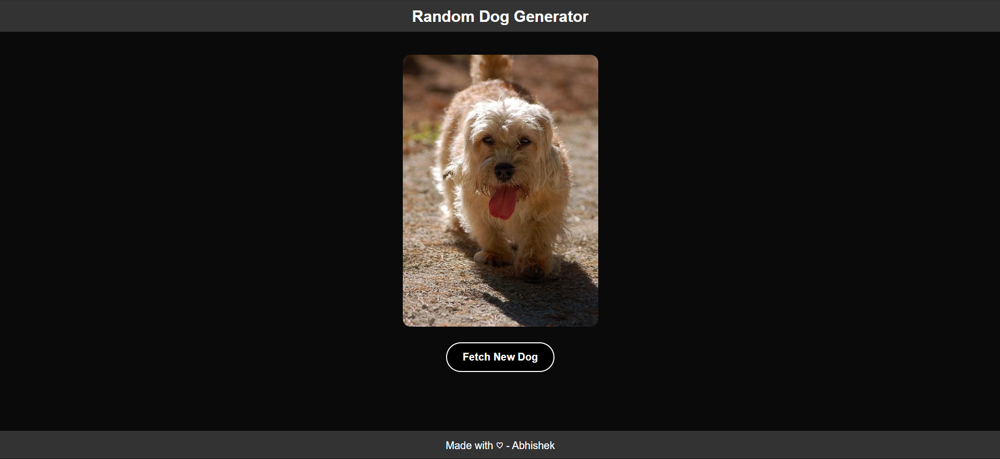

# Random Dog Generator

## 📌 About the Project

Random Dog Generator is a fun and simple web application that fetches and displays random dog images using the Dog CEO API. Users can generate a new dog image with a click of a button. The project is built using Next.js, styled with CSS, and leverages modern React hooks like useState and useEffect for dynamic content updates.

## 🚀 Features

- Fetches a random dog image from an API.

- Responsive design for mobile and desktop.

- A button to generate a new dog image.

- Clean UI with styled components.

## 🛠 Tech Stack

- Frontend: Next.js, React

- Styling: CSS

- API: Dog CEO API

## 📦 Installation

- Clone the repository:
```bash
git clone https://github.com/yourusername/random-dog-generator.git
cd random-dog-generator
```

- Install dependencies:

```bash
npm install
```

- Run the development server:

```bash
npm run dev
```

Open ``` http://localhost:3000 ``` in your browser.

## 🖼 Preview




## ✨ Usage

- Open the app.

- Click the "Fetch New Dog" button.

- Enjoy random dog images!

## 💡 Future Enhancements

- Add more styling improvements.

- Show dog breeds with images.

- Save favorite dog images.

## 📜 License

This project is open-source and available under the MIT License.

### Made with ❤️ using Next.js & React